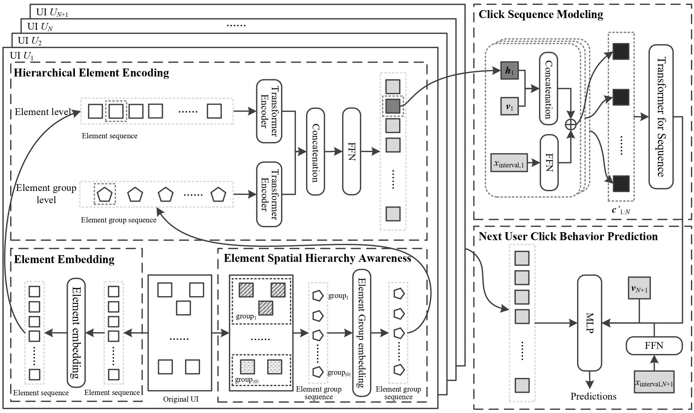

# 1 SHA-SCP
This repo is the official implementation for A UI element spatial hierarchy aware smartphone user click behavior prediction method
## 1.1 The framework of SHA-SCP


# 2 Prerequisites
- Python 3.10.4
- PyTorch 1.11.0
- math, sklearn, tensorboardX

# 3 Running

## 3.1 Training & Testing

You can modify the hyperparameters of model training in the train_eval.py file
```python
cd ..
# run the train and evaluation
python train_eval.py
# run the test
python test.py
```

# 4 Citation

Please cite this work if you find it useful.

If you have any question, feel free to contact: `kaiqian@zju.edu.cn`
